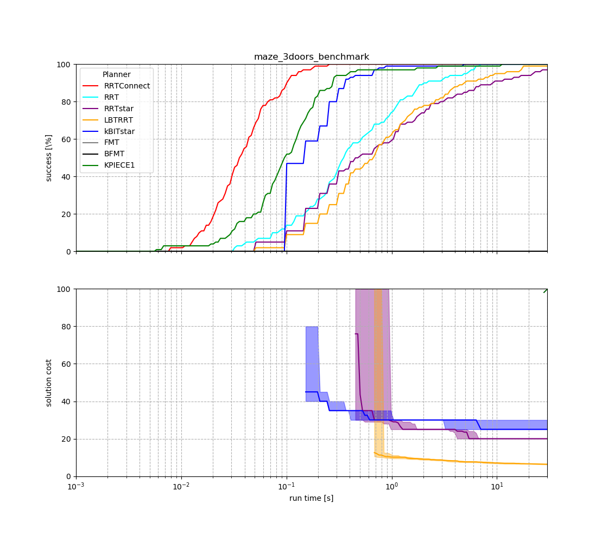

# ompl_benchmark_plotter

Take a database file from an OMPL benchmark and generate graphs and tables.

## Functionality 1 -- Optimality Graphs

```
  ./database_to_graph.py benchmark.db
```

Output: 



# TODO
- [ ] Table generation script (multiple db, possible split over algorithms)
- [ ] Table benchmark-to-benchmark improvement script
- [ ] options for each environment as a cfg file
- [ ] Automatically determine min cost, max cost, min time and max time.

