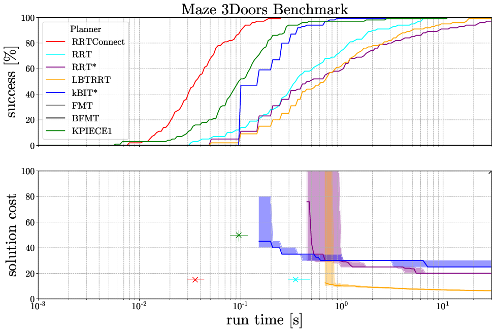

# ompl_benchmark_plotter

Take a database file from an OMPL benchmark and generate graphs and tables.

## Functionality 1: Optimality Graphs

```
  ./ompl_benchmark_plotter.py examples/example.db -s
```

Output: 


## Functionality 2: Average Runtime Table

```
  ./ompl_benchmark_plotter.py examples/example.db -t 1 -s
```

# Dependencies
```
sudo apt-get install texlive-latex-extra
sudo apt-get install apvlv
```

# TODO
- [ ] Table benchmark-to-benchmark improvement script
- [ ] Sum up multiple db files with same exp name
- [ ] Deterministic way to automatically pick colors

